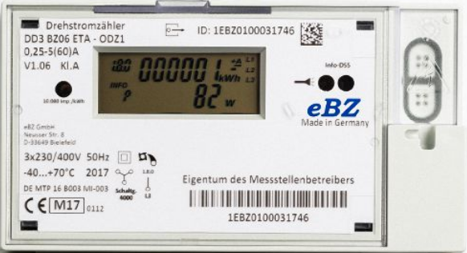
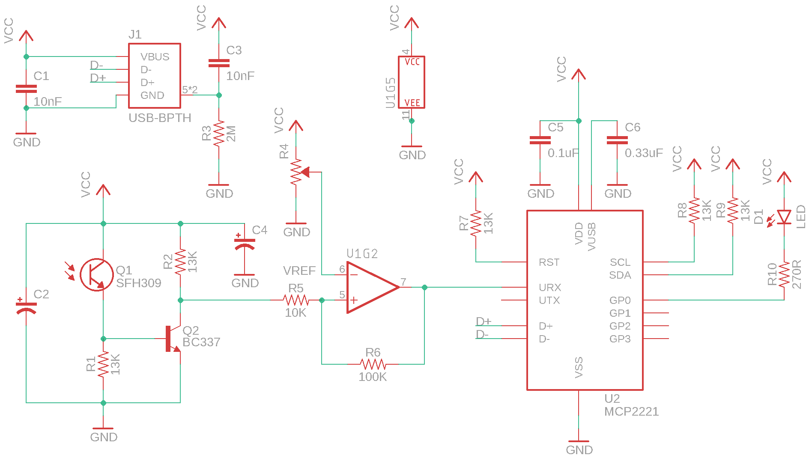
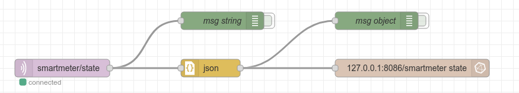
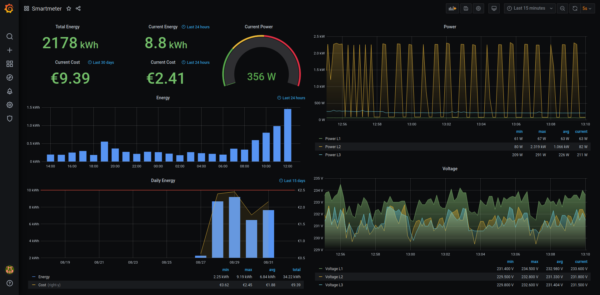

# Smartmeter

Read energy utility meter with a simple IR dongle

## Introduction

In the beginning of this year my analogue ferraris energy counter was replaced with a [smart energy meter][1] by the electricity network operator. This made my previous [pulsemeter][2] project obsolete and I had to come up with something new. Luckily the [volkszähler.org][3] project already supports reading many of the smartmeters available on the market and the wiki turned out be a great source of information. In the end, however, I didn't stick with the [vzlogger][4] software, but created my own smartmeter project from scratch.



## Hardware

It turns out that the 3-phase DD3 "Easy Basiszähler" energy meter is equipped with an optical interface which sends data every second. The communication protocol is described well in the [manual](resources/ebz_manual.pdf). This is one of the raw datagrams sent by the smartmeter every second with comments describing the [OBIS codes][5]:

```
/EBZ5DD3BZ06ETA_107                # serial number

1-0:0.0.0*255(1EBZ0100507409)      # custom ID
1-0:96.1.0*255(1EBZ0100507409)     # device ID
1-0:1.8.0*255(000125.25688570*kWh) # energy meter
1-0:16.7.0*255(000259.20*W)        # total power 
1-0:36.7.0*255(000075.18*W)        # L1 phase power
1-0:56.7.0*255(000092.34*W)        # L2 phase power
1-0:76.7.0*255(000091.68*W)        # L3 phase power
1-0:32.7.0*255(232.4*V)            # L1 phase voltage
1-0:52.7.0*255(231.7*V)            # L2 phase voltage
1-0:72.7.0*255(233.7*V)            # L3 phase voltage
1-0:96.5.0*255(001C0104)           # status
0-0:96.8.0*255(00104443)           # sensor lifetime in secs, 0x
!
EOM
```

The IR dongle used to collect the raw datagrams is based on the design of the [serial TTY model][6] at Volkszähler.org, but with an added USB interface:



## Software

The software stack consists of the following components:
- Smartmeter v0.2.7
- Mosquitto MQTT broker v2.0.7
- Node-RED v1.2.6
- InfluxDB v2.0.4
- Grafana 7.4.0

### Smartmeter daemon program

The smartmeter daemon is responsible for collecting the serial datagrams from the IR dongle and publishing the data to a shared memory ramdisk (so it doesn't wear out SD cards, etc.) and to a MQTT broker on the network such as [Mosquitto][7]. The config paramters are given in a separate [config file](resources/smartmeter.conf) or on the command line. A systemctl [service](resources/smartmeter.service) is also provided.

Help output:

```
Energy Smartmeter v0.2.7

Usage: ./build/smartmeter [options]

  -h --help         Show help message
  -V --version      Show build info
  -D --debug        Show debug messages
  -s --serial       Serial device
  -r --ramdisk      Shared memory device
  -H --host         MQTT broker host or ip
  -p --port         MQTT broker port
  -t --topic        MQTT topic to publish

Electricity tariff:
  -b --rate         Optional basic rate per month
  -k --price        Optional price per kWh
```

The Smartmeter daemon creates json formatted fields including a unix epoch timestamp with milliseconds precision and sends them to the the MQTT broker: 
```
[
  {
    "lifetime":19102823,
    "energy":2113.672678,
    "power":225.09,
    "power_l1":60.70,
    "power_l2":75.30,
    "power_l3":89.09,
    "voltage_l1":232.9,
    "voltage_l2":232.2,
    "voltage_l3":232.4,
    "rate":162.72,
    "price":0.2244,
    "time":1615228471351
  },
  {
    "serial":"EBZ5DD3BZ06ETA_107",
    "custom_id":"1EBZ0100507409",
    "device_id":"1EBZ0100507409",
    "status":"001C0104"
  }
]
```
### Node-RED

[Node-RED][8] is a programming tool for wiring together hardware devices with an easy to use web interface. The following [flow chart](resources/smartmeter-node-red.json) is used to connect the MQTT broker to the InfluxDB:




### InfluxDB

For persistant data storage the [InfluxDB][9] time series database is used. One big advantages of a time series databases like InfluxDB over a traditional SQL database is the automatic handling of data retention. With one datagram stored every second, a SQL database would get filled very quicky. With InfluxDB we have the possiblilty to configure a retention policy, which automatically prunes the database after a predefined time and keeps only the relevant data such as daily and monthly energy consumption. The magic behind the scenes is handled by continous queries, which are executed automatically in the specified time range.

Configuration of InfluxDB:

Create the InfluxDB `smartmeter` and a user `mqtt`:
```
$ influx
CREATE DATABASE "smartmeter"
CREATE USER "mqtt" WITH PASSWORD "mqtt"
GRANT ALL ON "smartmeter" TO "mqtt"
```
Create a new default retention policy to keep only 28 hours of primary data points:
```
CREATE RETENTION POLICY "rp28h" ON "smartmeter" DURATION 28h REPLICATION 1 DEFAULT
```
Define continous queries for data consolidation in the background:
```
CREATE CONTINUOUS QUERY cq1h ON smartmeter BEGIN SELECT last(energy) - first(energy) AS energy INTO smartmeter.rp28h.hourly FROM smartmeter.rp28h.state GROUP BY time(1h) TZ('Europe/Berlin') END
CREATE CONTINUOUS QUERY cq1d ON smartmeter BEGIN SELECT last(energy) - first(energy) AS energy, (last(energy) - first(energy)) * mean(price) + mean(rate) * 12 / 365 AS bill, last(energy) AS total INTO smartmeter.autogen.daily FROM smartmeter.rp28h.state GROUP BY time(1d) TZ('Europe/Berlin') END
CREATE CONTINUOUS QUERY cq30d ON smartmeter BEGIN SELECT sum(energy) AS energy, sum(bill) AS bill INTO smartmeter.autogen.monthly FROM smartmeter.autogen.daily GROUP BY time(30d) TZ('Europe/Berlin') END
CREATE CONTINUOUS QUERY cq365d ON smartmeter BEGIN SELECT sum(energy) AS energy, sum(bill) AS bill INTO smartmeter.autogen.yearly FROM smartmeter.autogen.daily GROUP BY time(365d) TZ('Europe/Berlin') END
```

### Grafana

The following [Grafana][10] dashboard shows the current and past energy consumption, available as a [json](resources/grafana-dashboard.json) file:




## Installation

Via Git:
```
git clone https://github.com/ahpohl/smartmeter.git
make
sudo make install
```
Or via Arch Linux package ([smartmeter][11]):
```
yaourt -S smartmeter mosquitto nodejs-node-red influxdb grafana-bin
```

Configuration:
```
nano /etc/smartmeter.conf
systemctl enable smartmeter.service
systemctl start smartmeter.service
...
```

## Changelog

All notable changes and releases are documented in the [CHANGELOG](CHANGELOG.md).

## License

This project is licensed under the MIT license - see the [LICENSE](LICENSE) file for details

[1]: https://www.ebzgmbh.de/ "Elektronischer Basiszähler"
[2]: https://github.com/ahpohl/pulsemeter "Pulse energy meter with Arduino and simple LED sensor"
[3]: https://volkszaehler.org/ "volkszähler.org - Das Smartmeter für jeden"
[4]: https://wiki.volkszaehler.org/software/controller/vzlogger "vzlogger - a tool to read and log measurements"
[5]: https://www.promotic.eu/en/pmdoc/Subsystems/Comm/PmDrivers/IEC62056_OBIS.htm "Description of OBIS code for IEC 62056 standard protocol"
[6]: https://wiki.volkszaehler.org/hardware/controllers/ir-schreib-lesekopf-ttl-ausgang "IR-Schreib-Lesekopf, TTL-Interface"
[7]: https://mosquitto.org/ "Eclipse Mosquitto - An open source MQTT broker"
[8]: https://nodered.org/ "Node-RED - Low-code programming for event-driven applications"
[9]: https://www.influxdata.com/ "InfluxDB: Purpose-Built Open Source Time Series Database"
[10]: https://grafana.com/ "Grafana: The open observability platform | Grafana Labs"
[11]: https://aur.archlinux.org/packages/smartmeter "Smartmeter Arch Linux package"

