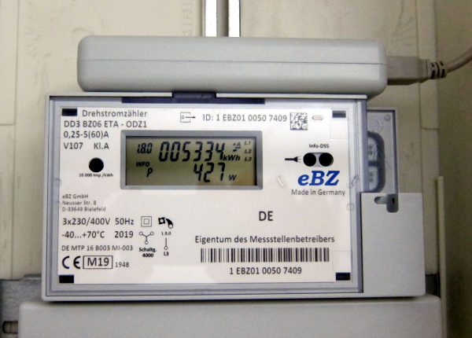

# Read energy utility meter with a simple IR dongle

In the beginning of this year my analogue ferraris energy counter was replaced with a [smart energy meter][1] by the electricity network operator. This made my previous [pulsemeter][2] project obsolete and I had to come up with something new. Luckily the [volkszähler.org][3] project already supports reading many of the smartmeters available on the market and the wiki turned out be a great source of information. In the end, however, I didn't stick with the [vzlogger][4] software, but created my own smartmeter project from scratch.



The software stack consists of the following components:
- Smartmeter v0.3.1
- PostgreSQL 13.2 with TimescaleDB 2.2.1 and pg_cron 1.3.1 extenstions
- Mosquitto MQTT broker 2.0.10
- Node-RED 1.3.2
- Grafana 7.5.3

## Installation

Via Git:
```
git clone https://github.com/ahpohl/smartmeter.git
make
sudo make install
```
Or via Arch Linux package ([smartmeter][13]):
```
yaourt -S smartmeter mosquitto nodejs-node-red influxdb grafana-bin
```

Configuration and startup:
```
nano /etc/smartmeter.conf
systemctl enable smartmeter.service
systemctl start smartmeter.service
```

## Changelog

All notable changes and releases are documented in the [CHANGELOG](CHANGELOG.md).

## License

This project is licensed under the MIT license - see the [LICENSE](LICENSE) file for details

[1]: https://www.ebzgmbh.de/ "Elektronischer Basiszähler"
[2]: https://github.com/ahpohl/pulsemeter "Pulse energy meter with Arduino and simple LED sensor"
[3]: https://volkszaehler.org/ "volkszähler.org - Das Smartmeter für jeden"
[4]: https://wiki.volkszaehler.org/software/controller/vzlogger "vzlogger - a tool to read and log measurements"
[5]: https://www.promotic.eu/en/pmdoc/Subsystems/Comm/PmDrivers/IEC62056_OBIS.htm "Description of OBIS code for IEC 62056 standard protocol"
[6]: https://wiki.volkszaehler.org/hardware/controllers/ir-schreib-lesekopf-ttl-ausgang "IR-Schreib-Lesekopf, TTL-Interface"
[7]: https://mosquitto.org/ "Eclipse Mosquitto - An open source MQTT broker"
[8]: https://nodered.org/ "Node-RED - Low-code programming for event-driven applications"
[9]: https://www.postgresql.org/ "PostgreSQL: The world's most advanced open source database"
[10]: https://www.timescale.com "Timescale: Time-series data simplified"
[11]: https://github.com/citusdata/pg_cron "pg_cron: Run periodic jobs in PostgreSQL"
[12]: https://grafana.com/ "Grafana: The open observability platform | Grafana Labs"
[13]: https://aur.archlinux.org/packages/smartmeter "Smartmeter Arch Linux package"

